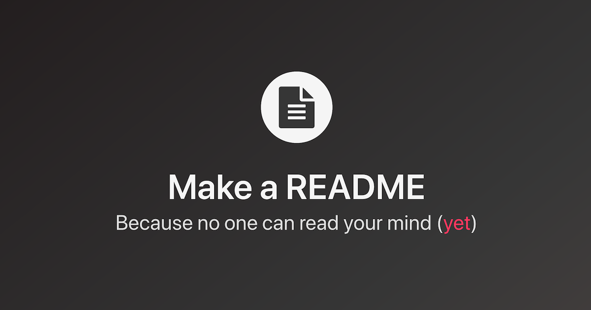

# Aprendendo Readme
 Criando o primeiro repositorio com README ✨

 []

 ## Tecnologias utilizadas
 -Git

 ## Como Utilizar:
 1 - Clone o projeto 
 ```
 git clone <Url do repositorio>

 ```
 2 - Acesse a pasta do projeto
  ```
 cd repositorio-com-readme

 ```
 3- Abra o seu readme com vs code através do git
  ```
 code .

 ```